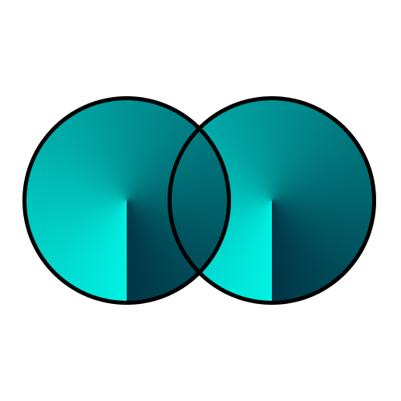

# Conjuntos Numéricos e Tabela Verdade

## Propriedades de Conjuntos 

Existem três operações possíveis entre dois ou mais conjuntos: a união de conjuntos, a intersecção de conjuntos e a diferença de conjuntos. 

| união | intersecção | diferença | vazio |
| - | - | - | - |
|  |  |  |  |

No que se refere aos conjuntos, as operações que podem ser realizadas são a união, a intersecção, e a diferença.

 

## Operações com conjuntos 

As operações entre dois conjuntos são a união, a intersecção e a diferença. O resultado de cada uma é também um conjunto. Veja a seguir como realizar cada uma delas. 

- ## União de conjuntos (U)
  
  A união de dois conjuntos é a junção de todos os elementos pertencentes a eles. Para representar a união entre os elementos do conjunto A e do conjunto B, utilizamos o símbolo U entre os conjuntos, ou seja, AUB (lê-se: A união com B). Podemos representar a união de dois com juntos pelo diagrama de Venn. 

  

  A união de dois conjuntos no diagrama é representada pelas regiões internas do círculo do conjunto A e do círculo do conjunto B. 

  ### Exemplo 
  - Dado os conjuntos A={1, 3, 5, 7, 11, 12} e B={1, 2, 3, 4, 6, 8, 9}, como será a união entre eles, ou seja, AUB?
   
  **AUB={1, 2, 3, 4, 5, 6, 7, 8, 9, 11, 12}**
   
  Repare que, mesmo possuindo números em comum, ao realizar a união, eles não são repetidos dentro do conjunto AUB. 

   

- ## Intersecção de conjuntos (∩) 
  
  A intersecção de conjuntos é o conjunto formado pelos elementos que se repetem (que estão em comum) em todos os conjuntos. Representamos a intersecção pelo símbolo ∩, então, para representar a intersecção do junto A com o conjunto B, utilizamos A∩B. Podemos representar a intersecção entre dois conjuntos no diagrama de Venn:
  
  

  No diagrama, a intersecção dos dois conjuntos é representada pela área que pertence ao conjunto A e ao conjunto B, simultaneamente, na imagem, é região destacada em preto. 
  
  ### Exemplo 

  - Dado os conjuntos A={1, 3, 5, 7, 11, 12} e B={1, 2, 3, 4, 6, 8, 9}, como será a intersecção entre eles, ou seja, A∩B?
   
  **A∩B={1, 3}**
  
   

- ## Diferença entre conjuntos (–) 
  
  A diferença entre conjuntos é caracterizada pelos elementos que pertencem ao primeiro conjunto mencionado, por exemplo, dado o conjunto A e o conjunto B, a diferença entre eles, será representada por A–B, que é o conjunto de elementos que pertencem apenas ao conjunto A. Veja no diagrama de Venn: 
  
  

  ### Exemplo 

  - Dado os conjuntos A={1, 3, 5, 7, 11, 12} e B={1, 2, 3, 4, 6, 8, 9}, como será a diferença entre eles, ou seja, A–B? 
   
  **A–B={5,6,7,11,12}**
   
  Perceba que, para encontrar a diferença, termos que identificar aqueles que pertencem exclusivamente ao conjunto A, e então, ao remover os elementos que também pertencem ao conjunto B, teremos a diferença entre os conjuntos. 

   

- ## Conjunto vazio (Ø)
  
  O conjunto vazio é um caso particular de uma operação sem resultado entre conjuntos, por exemplo, dado o conjunto A e o conjunto B, a diferença entre eles não existe, então vamos representar esse resultado com o símbolo Ø ou com colchetes vazios ( { } ). 
  
  

  ### Exemplo 

  - Dado os conjuntos A={1, 3, 5, 7} e B={1, 3, 5, 7}, como será a diferença entre eles, ou seja, A–B? 
   
  **A–B={ }**
   
  OU
   
  **A–B=Ø**